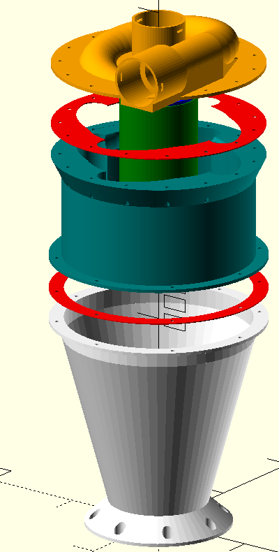
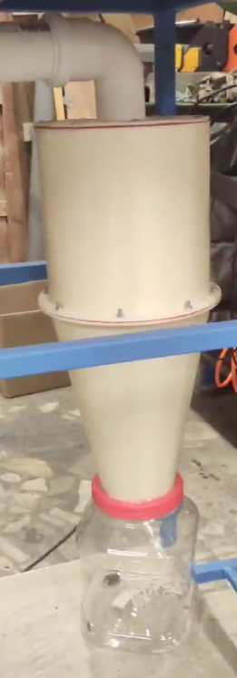
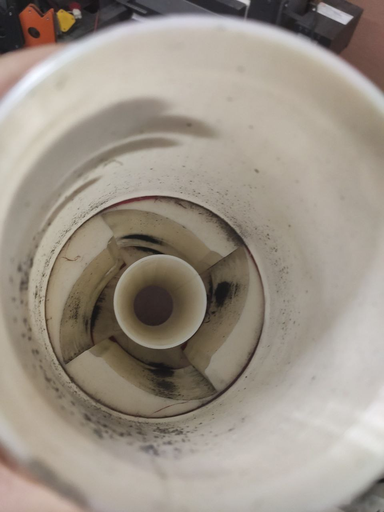

= 3d printed cyclone dust collector
:openscad_lib_name: cyclone_dust_collector

This library contains cyclone filter "with caverns" generator, that effectively collects small particle dust.
Can be used at a shop, as a wooden CNC filter, etc.

Produced 3D models can be then printed. For gaskets a TPU of other flex materials can be used.

Consumer grade vacuum with HEPA filter should be enough. It must be connected to the cyclone outlet hole.

[cols=2]
|===
a|
.Cyclone filter parts

a|
.Assembled

|===

This library depends on https://github.com/nophead/NopSCADlib[NopSCADlib] and can be used as a git submodule in NopSCADlib styled CAD projects:

[source,bash,subs=attributes+]
----
git clone submodule https://github.com/eraga/{openscad_lib_name} lib/{openscad_lib_name}
----

== Example usage

[source,openscad,subs=attributes+]
----
include <../libs/{openscad_lib_name}/{openscad_lib_name}s.scad>

cyclone_assembly(SMALL_CYCLONE, trans = 100);
----

== About

[.left]
.Cyclone generator part after some use

The cyclone with caverns performance results are described in xref:docs/issledovanie-harakteristik-tsiklona-s-vnutrennimi-elementami.pdf[the paper] in the `docs` section.

